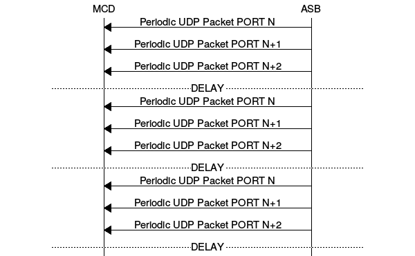
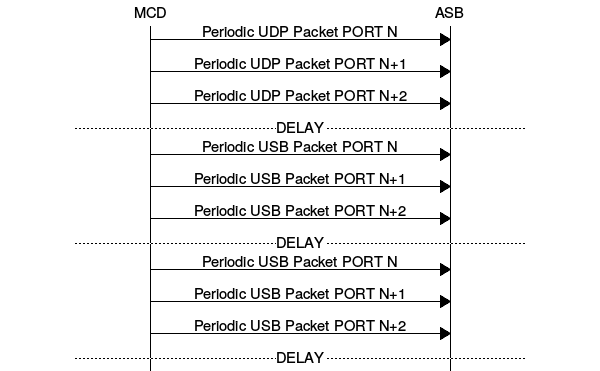
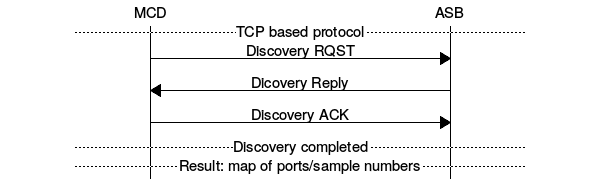
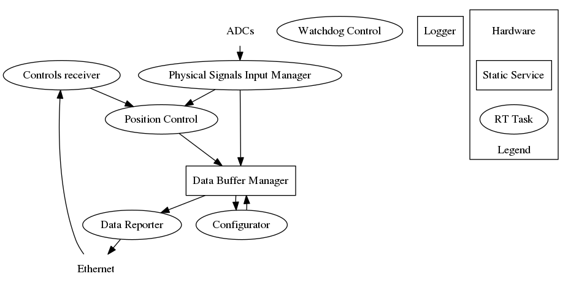

<!---
(to convert to PDF pandoc -s -o asbdesign.pdf  design.md)

(online editor: http://jbt.github.io/markdown-editor/)

to generate TX protocol:
 protocol -b 8 --oddchar "-" --startchar "-" --endchar "-" "0x57421064:32,running counter:16,sample len msec:16,sample 1:32,...:32,sample N:32,0x20349817:32"

to generate RX protocol:
protocol -b 8 --oddchar "-" --startchar "-" --endchar "-" "0x57421064:32,running counter:16,control:32,0x20349817:32"


Discovery protocol
protocol -b 8 --oddchar "-" --startchar "-" --endchar "-" "discovery RQST:8,MCD ID:32"

protocol -b 8 --oddchar "-" --startchar "-" --endchar "-" "Discovery Reply:8,protocol ver:16,ASB ID:32,size:4,size:4,size:4,size:4,size:4,size:4,size:4,size:4,size:4,size:4,size:4,size:4,size:4,size:4,size:4"

protocol -b 8 --oddchar "-" --startchar "-" --endchar "-" "discovery ACK:8"

-->


# Autonomous Sensor Board (ASB) module design

## Version 0.1

### Summary:

The first version of ASB is intended to be used in FRC device based on the currently existing G20 board. The first release of FRC intended as a product and at the same time as a prove of concept. The main areas that will be evaluated based on the results of this project are:

- usability, convenience and adaptability of ASB as an individual device connected to MDC over Ethernet
- ASB calibration process
- ASB network topology, IP address assignment, etc.
- manufacturing process and tracking with the emphasis on network features: IP address, MAC address
- protocol usability

Less attention will be given to CPU load and performance of G20-based ASB, since the future implementation of ASB supposed to use a dedicated MCU (RZ/N by Renesas). In fact the maximum effort will be given to adapt the existing G20 platform to achieve the FRC best performance. Some compromises in jitter and network performance are expected.


1. General description
   - ASB main functionality features:
     - raw data collection from attached ADCs
     - sending data to attached DACs
     - conversion of raw data from ADC to the measured signal units of measurement
     - conversion of control (output) data to DAC units
     - periodic sending of measured data to MDC over Ethernet
     - receiving of control data and immediate acting upon the output (DAC) commands
     - PID position control

2. Linux, RTOS, Xenomai, framework and related topics

The first version of ASB will be based on the current Linux/Xenomai OS, the only anticipated kernel changes are for ADC support.

3. Communications principles

The main function of ASB is to collect data from ADCs, to convert it to physical measurements and to transfer the reading(s) to MDC. Ethernet is chosen as a medium for data transferring from ASB to MDC. The standard UDP protocol will be used for data transfer. Simultaneously with sending data out of ASB an incoming stream of UDP data will be used for DAC position control.

4. Protocol definitions
   - data transferring protocol

 \newline

```
                           0 1 2 3 4 5 6 7
                          -----------------
                          |               |
                          -               -
                          |               |
                          -   0x57421064  -
                          |               |
                          -               -
                          |               |
                          -----------------
                          |               |
                          -running counter-
                          |               |
                          -----------------
                          |               |
                          -sample len msec-
                          |               |
                          -----------------
                          |               |
                          -               -
                          |               |
                          -    sample 1   -
                          |               |
                          -               -
                          |               |
                          -----------------
                          |               |
                          -               -
                          |               |
                          -      ...      -
                          |               |
                          -               -
                          |               |
                          -----------------
                          |               |
                          -               -
                          |               |
                          -    sample N   -
                          |               |
                          -               -
                          |               |
                          -----------------
                          |               |
                          -               -
                          |               |
                          -   0x20349817  -
                          |               |
                          -               -
                          |               |
                          -----------------
```
   - control receiving protocol

 \newline

```
                           0 1 2 3 4 5 6 7
                          -----------------
                          |               |
                          -               -
                          |               |
                          -   0x57421064  -
                          |               |
                          -               -
                          |               |
                          -----------------
                          |               |
                          -running counter-
                          |               |
                          -----------------
                          |               |
                          -               -
                          |               |
                          -    control    -
                          |               |
                          -               -
                          |               |
                          -----------------
                          |               |
                          -               -
                          |               |
                          -   0x20349817  -
                          |               |
                          -               -
                          |               |
                          -----------------
```

   - discovery protocol

 \newline

```
                           0 1 2 3 4 5 6 7
                          -----------------
                          | discovery RQST|
                          -----------------
                          |               |
                          -               -
                          |               |
                          -     MCD ID    -
                          |               |
                          -               -
                          |               |
                          -----------------


                           0 1 2 3 4 5 6 7
                          -----------------
                          |Discovery Reply|
                          -----------------
                          |               |
                          -  protocol ver -
                          |               |
                          -----------------
                          |               |
                          -               -
                          |               |
                          -     ASB ID    -
                          |               |
                          -               -
                          |               |
                          -----------------
                          |  size |  size |
                          -----------------
                          |  size |  size |
                          -----------------
                          |  size |  size |
                          -----------------
                          |  size |  size |
                          -----------------
                          |  size |  size |
                          -----------------
                          |  size |  size |
                          -----------------
                          |  size |  size |
                          -----------------


                           0 1 2 3 4 5 6 7
                          -----------------
                          | discovery ACK |
                          -----------------
```

5. Data inputs sampling
6. Outputs actuation
7. SW architecture



8. Glossary

ADC - Analog-to-Digital Converter

ASB - Autonomous Sensor Board

DAC - Digital-to-Analog Converter

FRC - Flow Ratio Controller

HW - Hardware

IP - Internet Protocol

MCU - Microcontroller

MDC - Master Device Controller

PID controller - Proportional–Integral–Derivative controller

SW - Software

UDP - User Datagram Protocol

1. SW Tools to be developed (diagnostic, testing)
   - UDP QoS monitor (wireshark based)
     - packet inter-arrival variations (jitter)
     - fragmentation warning
   - protocol verificator
     - each protocol field check
   - data monitoring
     - data charting
     - deviation calculations

2. HW used in development
   - G20 board
   - local switch

3. Operational HW AIs:
   - Ethernet switch
   - signals layout (SPI and Interrupt signals)


### Current AIs:

- [ ] Evaluate select() for UDP sockets
- [ ] Establish inter-task communication model
- [ ] Investigate UDP broadcast to the range of IP addresses

### Renesas AIs:
- [ ] To get more info about R-IN32M3

